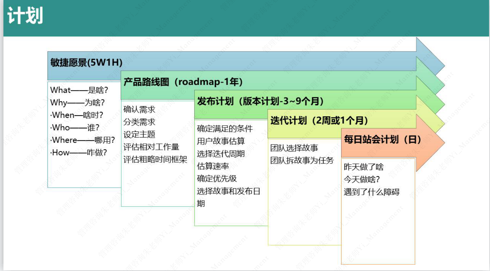

# 敏捷

## 定义

敏捷是一种通过创造变化和响应变化在不确定和混乱的环境中取得成功的能力

## 历史

* 1991 - RAD（Rapid Application Development）
* 1994 - DSDM(Dynamic systems development method)
* 1995 - Scrum
* 1996 - XP(Crystal Clear,Extreme Programming)极限编程
* 1997 - FDD(Feature-driven development)特征驱动开发

2001年，17位软件开发人员聚集在犹他州的Snowbird，讨论他们的共同想法和各种软件开发方法。经过讨论他们达成了在价值观和原则的共识，并共同发布了敏捷软件开发宣言和相应的十二条原则，宣告了敏捷开发运动的开始。
会议之后，敏捷联盟成立，鼓励业界从业者进一步探索和分享想法和经验

## 敏捷宣言

1. 个体和互动   高于     流程和工具
2. 工作的软件   高于     详尽的文档
3. 客户合作     高于     合同谈判
4. 响应变化     高于     遵循计划

## 敏捷十二原则

1. 我们最重要的目标，是通过及早和持续不断交付有价值的软件使客户满意
2. 欣然面对需求变化，即使在开发后期也一样，为了客户的竞争优势，敏捷过程掌控变化
3. 经常地交付可工作的软件，相隔几星期或一两个月，倾向于采取较短的周期
4. 业务人员和开发人员必须相互合作，项目中的每一天都不例外
5. 激发个体的斗志，以他们为核心搭建项目。提供所需的环境和支援，辅以信任，从而达成目标
6. 不论团队内外，传递信息效果最好效率也最高的方式是面对面交谈
7. 可工作的软件是进度的首要度量标准
8. 敏捷过程倡导可持续开发。责任人、开发人员和用户要能够共同维持其步调稳定延续
9. 坚持不懈地追求技术卓越和良好设计，敏捷能力由此增强
10. 以简洁为本，它是极力减少不必要工作量的艺术
11. 最好的架构、需求和设计出自自组织团队
12. 团队定期地反思如何提高成效，并依次调整自身的行为表现

## 敏捷宣言诞生记
2001年2月11日至13日，在美国犹他州瓦萨奇山雪鸟滑雪胜地，17个人聚到一起，交谈、滑雪、休闲，当然还有聚餐。

## 敏捷愿景（5W1H)
What?  Why?  When?  Who?  Where?  How?

## 敏捷词汇表

| 英文        |   中文           | 
| ------------- |:-------------:|
| Scrum         | Scrum无对应中文翻译 |
| Agile         | 敏捷     |
| Lean          | 精益      |
| Iterative |	迭代式的 |
| Iteration	|迭代|
| Agile Manifesto	|敏捷宣言|
| Empirical	|经验性的|
| Empirical Process|	经验性过程|
| Transparency	| 透明性|
| Inspect and Adapt	|检视与调整|
| Sprint|	原意为冲刺，Scrum中的Sprint无对应中文翻译，指一个迭代|
| Sprint Goal|	Sprint目标|
| Product Owner|	 产品负责人 简称PO|
| Scrum Master 	|简称SM, 一般不翻译|
| Development Team |	 Scrum开发团队|
| Scrum Team |	指PO,SM和开发团队|
| Scrum Roles	| Scrum角色，指PO,SM和开发团队|
| Emergent 	| 涌现的 |
| Product Backlog	|产品待办列表，指需求清单|
| Sprint Backlog|	Sprint待办列表，指Sprint任务清单|
| Sprint Burn-down Chart|	Sprint燃尽图，团队用于做Sprint内的进展跟踪|
| Release Burn-down Chart	|发布燃尽图，产品负责人做发布进展跟踪|
| Sprint Planning Meeting	|Sprint计划会议|
| Daily Scrum Meeting	|每日站会|
| Sprint Review Meeting	|Sprint评审会议|
| Sprint Retrospective Meeting	| Sprint回顾会议|
| Product Backlog Refinement	|产品待办列表梳理|
| Product Backlog Item	|产品待办清单条目，简称PBI|
| User Story	| 用户故事，指一条需求|
| Story Point	| 衡量用户故事的工作量大小的计量单位|
| Velocity	| 团队速度|
| Sprint Task	 | 实现一条需求需要做的一个技术任务|
| Definition of Done	| DoD，完成的定义|
| Stakeholders	| 干系人 |
| Backlog	|待办列表 |
| Artifact |	工件 |
| Estimation |	估算 |
| Collaboration	|协作  |
| Scaling Scrum	|大规模Scrum|

## 计划
