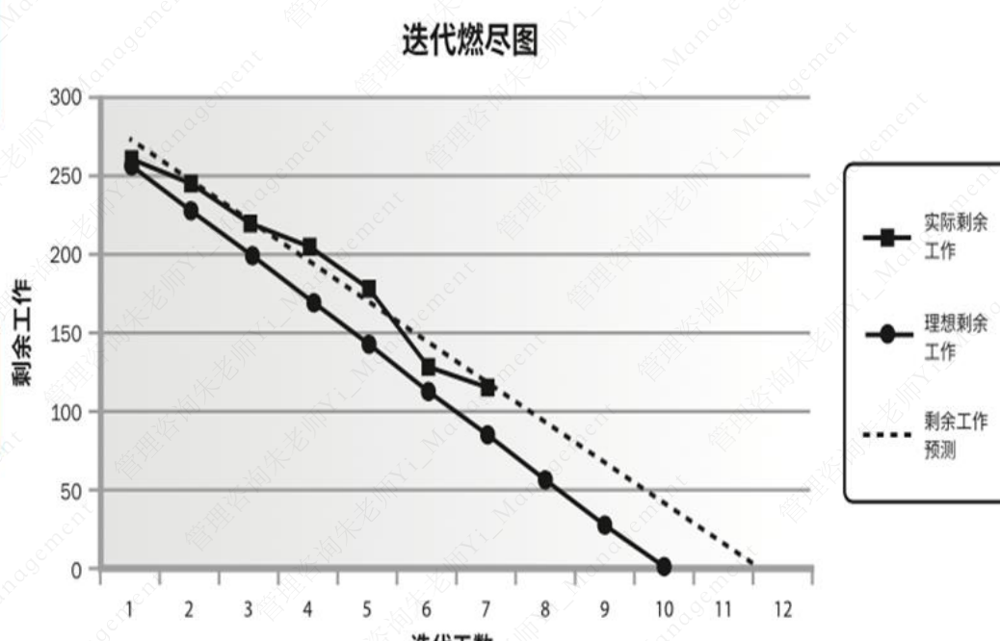
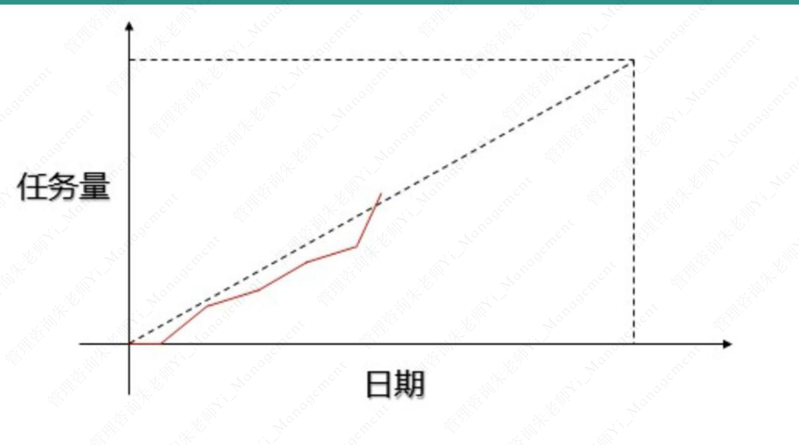

# 项目群

敏捷项目管理指出，价值是外在的，可通过交付功能来体现，质量是内在的。

## 传统铁三角
范围、成本、进度

## 敏捷三角
价值、质量、制约因素（成本、进度、范围）

## 敏捷铁三角
进度、范围、成本

## 敏捷项目管理框架
1. 构想：确定产品愿景，项目范围，项目群体以及团队如何一起共事
2. 推测：开发基于特征的版本，里层碑和迭代计划去交付愿景
3. 探索：在短时间内交付已测试的特征，持续致力于降低项目的风险和不确定性
4. 适应：评审交付的结果，当前形势，团队绩效和必要的调整
5. 结束：结束项目，传递主要经验教训

## 发布计划VS迭代计划
发布计划期待产品的发布，而迭代计划只关注迭代长度
> 发布计划
1. 发布计划基于用户故事
2. 计划水平线是3-9个月
3. 估算在故事点或理想日完成
> 迭代计划
1. 基于任务
2. 计划水平线是1-4个月
3. 估算在理想小时完成

## 敏捷合同
敏捷合同涵盖项目的敏捷本质
1. 目标
2. 项目构成
3. 关键人员
4. 支付条款
5. 结束条款
6. 法律细节

## 敏捷项目章程
### 定义
项目章程是个列有积极参与项目的相关干系人清单的重要参考文件
### 目的
提供项目目标、成本、预算、期限、可交付物、沟通渠道和频率的总体概述

## 商业论证
1. 商业论证通常是项目章程的一部分
2. 商业论证的参与者可以是用户、产品负责人、管理层或其他干系人

## 燃尽图

### 价值
1. 基于迭代规划中确定的工作，分析与理想燃尽图的偏差
2. 追踪迭代未完项中尚待完成工作

### 方法
1. 对角线表示理想的燃尽情况
2. 在每天画出实际剩余工作
3. 基于剩余工作计算出趋势线进行预测完成情况

## 燃起图

