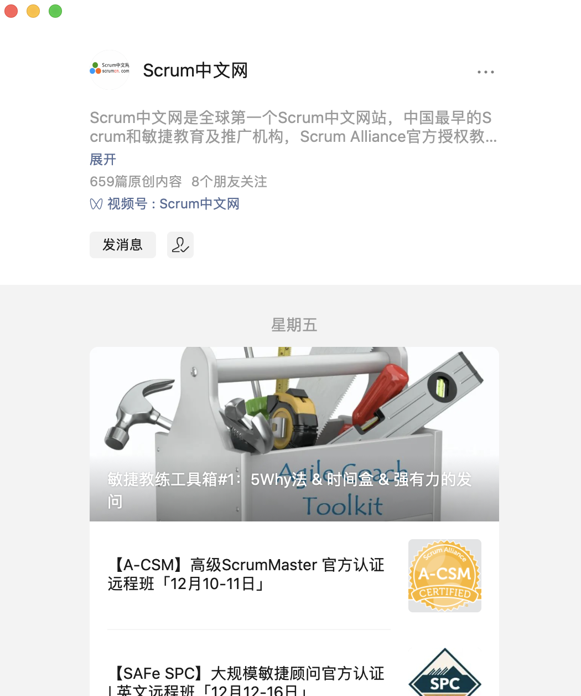

# Scrum

## 定义

1. 轻量的

2. 易于理解的
3. 难以精通的

## 精髓

小团队

## 三大支柱

1. **透明性**（软件开发过程的各个环节高度的可见效）
2. **检视**（开发过程中的各方面做到足够频繁的检验）
3. **适应**（在检验发现偏差，不符合验收标准，即使调整，减少进一步的偏差）

## 框架

Scrum框架（3355）包括3个角色、3个工件、5个事件、5个价值

> 3个角色
1. 产品负责人(Product Owner）
2. 开发团队(Development Team)
3. Scrum Master
备注：scrum团队是跨职能的自组织团队

> 3个工件
1. 产品Backlog(Product Backlog)
2. SprintBacklog
3. 产品增量(Increment)

> 5个事件
1. Sprint（Sprint本身是一个事件）
2. Sprint计划会议(Sprint Planning Meeting）
3. 每日Scrum站会（Daily Scrum Meeting )
4. Sprint评审会议(Sprint Review Meeting)
5. Sprint回顾会议(Sprint Retrospective Meeting)

> 5个价值
* **承诺** - 愿意对目标做出承诺
* **专注** - 把你的心思和能力都用到你承诺的工作上去
* **开放** - Scrum把项目中的一切开放给每一个人看
* **尊重** - 每个人都有他独特的背景和经验
* **勇气** - 有勇气做出承诺，履行承诺，接受别人的尊重

## 角色-团队组成

### 产品负责人（Product Owner）工作

1. 清晰地表述产品代办列表项
2. 对产品待办列表项进行排序，使其最好地实现目标和使命
3. 优化开发团队所执行工作的价值
4. 确保产品待办列表对所有人是可见、透明和清晰的，同时显示scrum团队下一步要做的工作
5. 确保开发团队对产品待办列表项有足够深的理解

###  开发团队(Developers)特点

1. 他们是自组织的，没有人有权告诉开发团队应该如何把产品待办列表变成潜在可发布的功能增量
2. 开发团队是跨职能团队，团队作为一个整体，拥有创建产品增量所需的全部技能
3. Scrum不认可开发团队成员的任何头衔，不管其承担何种工作
4. Scrum不认可开发团队所谓的“子团队“，无论其需要处理的领域是诸如测试、架构、运维或业务分析
5. 开发团队中的每个成员也许有特长和专注的领域，但是责任属于整个开发团队

### Scrum Master
* 对Scrum团队而言，Scrum Master是一位服务型领导

* 服务于产品负责人
    1. 确保Scrum团队中的每个人都尽可能地理解目标、范围和产品领域
    2. 找到有效管理产品待办列表的技巧
    3. 帮助Scrum团队理解为何需要清晰且简明的产品待办列表项
    4. 理解在经验主义的环境中的产品规划

* 服务于开发团队
    1. 作为教练在自组织和跨职能方面给予开发团队以指导
    2. 帮助开发团队创造高价值的产品
    3. 移除开发团队工作进展中的障碍
    4. 按被请求或需要时，引导Scrum事件
    5. 在Scrum还未完全采纳和理解的组织环境中，作为教练指导开发团队

* 服务于组织
    1. 带领作为教练指导组织采纳Scrum
    2. 在组织范围内规划Scrum的实施
    3. 帮助员工和利益攸关者理解并实施Scrum和经验导向的产品开发
    4. 引发能够提升Scrum团队生产率的改变
    5. 与其他Scrum Master一起工作，增强组织中Scrum应用的有效性

## Sprint
 Sprint 是Scrum的核心

## 用户故事
定义：一个可以给客户增值的小型颗粒状态工作单元

## 结对编程
是一种比较好的方式，技术比较好的工程师和经验不足的工程师结对编程，以提升自己的能力

### 可在微信公众号搜索最新文档：Scrum中文网

