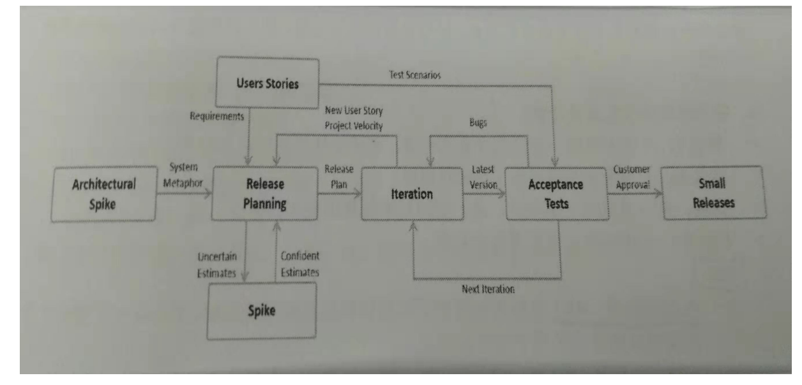

# 敏捷方法工具

着重点：估算、项目规模测量、优先级、XP、价值流、MMF、累积流量图、问题检测

## 估算

### 定义
估算是对交付计划产品所需要的成本、进度、投入或者技能进行的预测
### 敏捷估算
	1、为什么需要估算
		估算让团队了解项目的规格，计算ROI和IRR，形成项目执行许可的基础
	2、谁执行估算？
		敏捷团队基于产品负责人的投入来估算需求，Scrum Master进行保守估算
	3、估算会议什么时候进行？
		整个项目期间进行。在项目逐步完善中更对信息出现，团队定期评估新需求
	4、估算如何创建？
		团队使用计划扑克或者亲和估算等技术来确定需求估算

## 项目规模测量

* 传统测量：行代码，功能点
* 敏捷测量：故事点、理想时长（理想日）

```
> 相对尺码
	1、相对尺码是敏捷估算中的重要概念
	2、与测量绝对值不同的是，它通过对比基线来确定需求的大小
	3、相对尺码运用在估算点估算用户故事时
> 故事点
	定义：描述一个用户故事及其相关努力总体规模的测量单元
> 价值点
	敏捷强调交付价值和成果
	1、价值点展示一个故事的相对商业价值
	2、针对故事价值，运用相同的相对尺码技术，将提供对总体交付价值的估算
	3、利益相关者共同参与到将故事或特征价值量化的工作中
	4、价值点将给估算带来真正的权利
> 理想日
	考虑问题：正在进行的唯一任务；没有中断；所有需要的信息都可用；
> 故事点 VS 理想日
	故事点：
		1、有助于驱动跨职能行为；
		2、故事点估算不会衰变；
		3、纯规模测量；
		4、故事点估算时间很低
	理想日：
		1、同样的团队内理想日游差异；
		2、理想日在团队外部容易说明，故事点更加抽象
		3、理想日迫使公司面对浪费时间的活动
> 宽带德尔菲（准确估算、宽带德尔菲技术之计划扑克【数字卡，偏高偏低原因】）
> 亲和估算（用于估算大规模用户故事）
	1、优势：快速简单；决策制定过程透明可见；积极合作的体验而非对抗性
	2、步骤：沉默的相对尺码；编辑墙；将物品置于相对尺码栏；产品负责人挑战；储备数据
```

## 优先级

* 目的：识别高价值特征(功能）并且使它们得到优先交付
* 优先级技术：
    - MoSCow技术（动态系统方法DSDM用的就是该技术进行需求优先级排序）
		+ Must:必须有 - 强调需求的强制性
		+ Should应该有 - 这些需求不是强制性的，但是高度渴望的
		+ Could可以有 - 这些需求如果满足会更好
		+ Won’t不会有 - 当下可以不去满足，但是将来可以加入
	- Kano模型
		+ 方面：基本需要；性能需要；愉悦需要
		+ 类别：门槛；线性；愉悦要求；淡漠
	- 相对量级
		+ 基于成本、风险和处罚后能提供最大益处的特征（功能）

## XP（极限编程）

### 作用用于
1. 快速响应需求变化的高成本
2. 建立强大的工程实践去提升软件质量
3. XP的软件开发方法引入了许多革命性的概念成为现在的标准实践
>（测试驱动开发、持续集成、迭代、用户故事）

### 核心原则
1. 沟通（用户和程序员的频繁合作；运用简单的设计）
2. 简单
3. 反馈
4. 勇气
5. 尊重

### 形式
1. 共用电脑、共用鼠标
2. 同时都是开发，都是评审

### 场景
1. 老人带新人（高级带初级/新员工）
2. 技能复制（有人离职）
3. 遇到困难（组合攻关）

### XP流程图


## 价值流
### 定义
价值是对交付的产品或服务产生的收益的衡量
### 包括
员工人均收入、创新率、客户满意度、员工满意度、客户使用情况、客户留存率、回头客户、投资回报
### 货币时间价值的相关计算：………
1. IRR内部收益
2. NPV净现值
3. ROI投资回报率
### 价值流图
用来分析信息流、人员和交付产品或服务给客户所需资源的技术


## MMF(最小可售特征）
MMF是最小特征（功能）集合，能够给项目提供最大价值，有利于提高项目的可预测性和灵活性

## 累积流量图
1. 定义
    - 累积流量图是追踪和预测敏捷项目的主要工具

2. 累积流量图 - 小定律（利特尔法则）
    - 有助于确定系统库存数量，小定律表明在一一个即定的在制品（WIP）水平，WIP与前置时间之比等于吞吐量
    - 平均吞吐量=WIP（在制品数量）/ Lead time（前置时间）


## 敏捷问题检测

技术：
1. 鱼骨图(石川图或因果图)
	+ 是一种快速有效识别问题或肤陷的根本原因分析方法。
	+ 常和5whys一起用
2. 5whys
	+ 是一种通过不断重复询问为什么来识别根本问题根本原因的技术。
3. 控制图
	+ 是一个设置有控制界限的图表
4. 前置时间和循环时间
5. 在制品（WIP）
    + 是团队以及开始进行但还没完成的需求