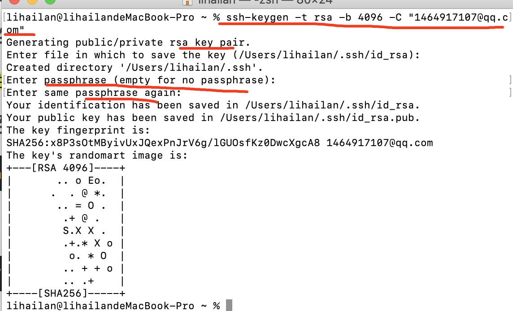
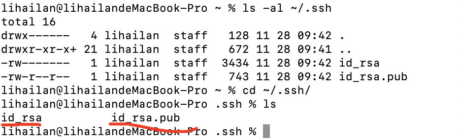
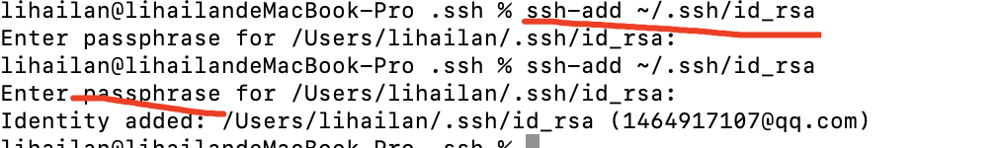
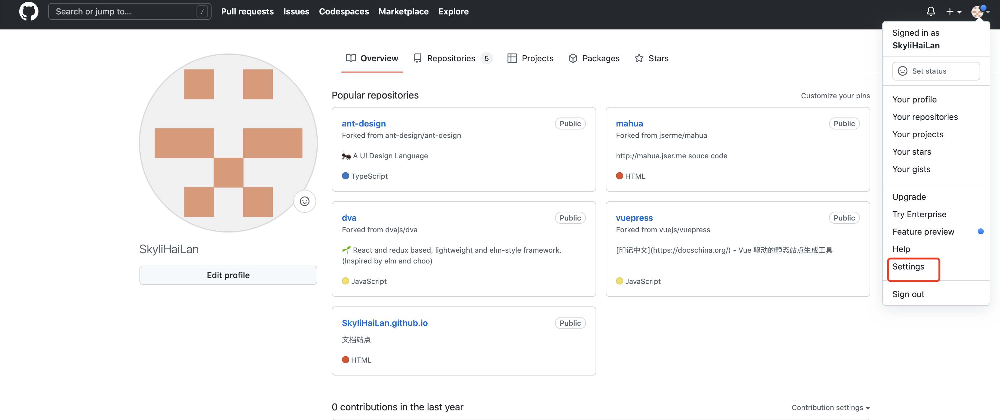
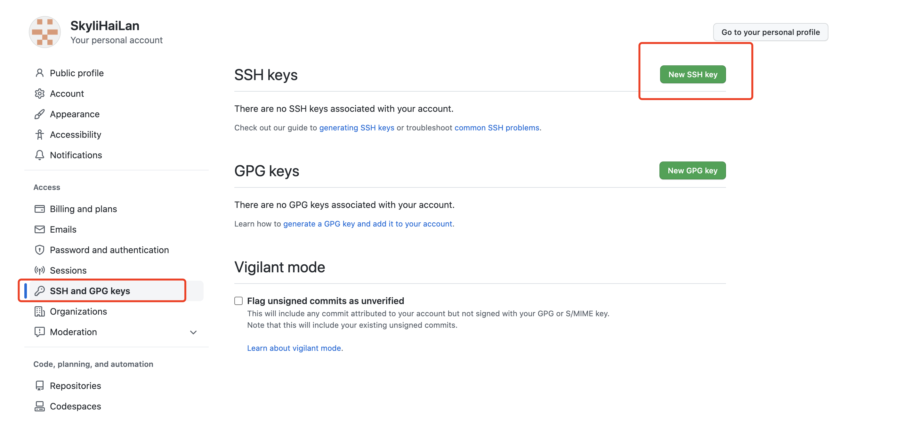

# SSH配置

### 查看是否有ssh keys ,执行命令
```
ls -al ~/.ssh
```

### 如果没有SSH Key,则需要先生成一下,执行
```
ssh-keygen -t rsa -b 4096 -C "your email"
```
回车默认，在输入密码，密码自己设置

  
### 生成2个文件，私钥和公钥


### 执行ssh-agent,把专用密钥添加到ssh-agent的高速缓存中，执行后输入密码
```
ssh-add ~/.ssh/id_rsa
```


### 打开github,进入创建密钥



### 打开id_rsa.pub 文件，复制密码到gitbub
```
进入ssh密钥，执行
ls .ssh
打开id_rsa.pub 文件，执行
more id_rsa.pub
```

### 设置git的username和email

```
git config --global user.name "your user name"
git config --global user.email  "your email"
```
<code>提示，如果想从ssh-agent中删除密钥“ssh-add -d ~/.ssh/id_rsa.pub”</code>